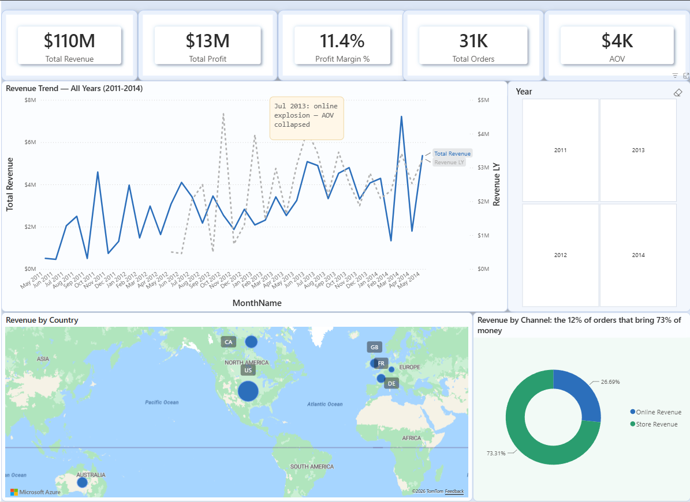
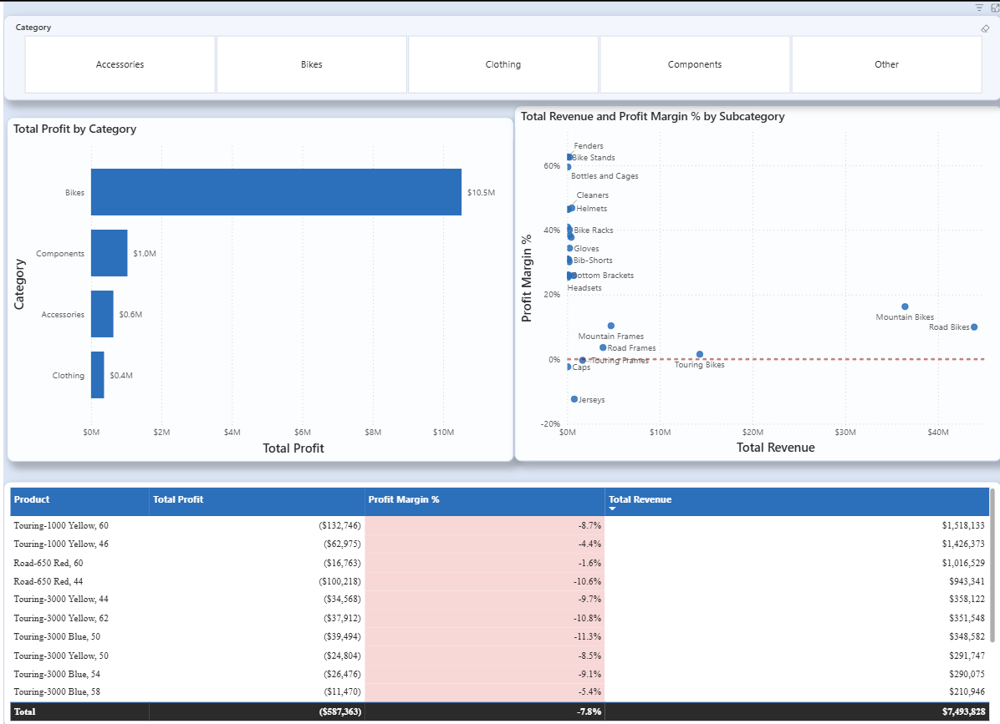
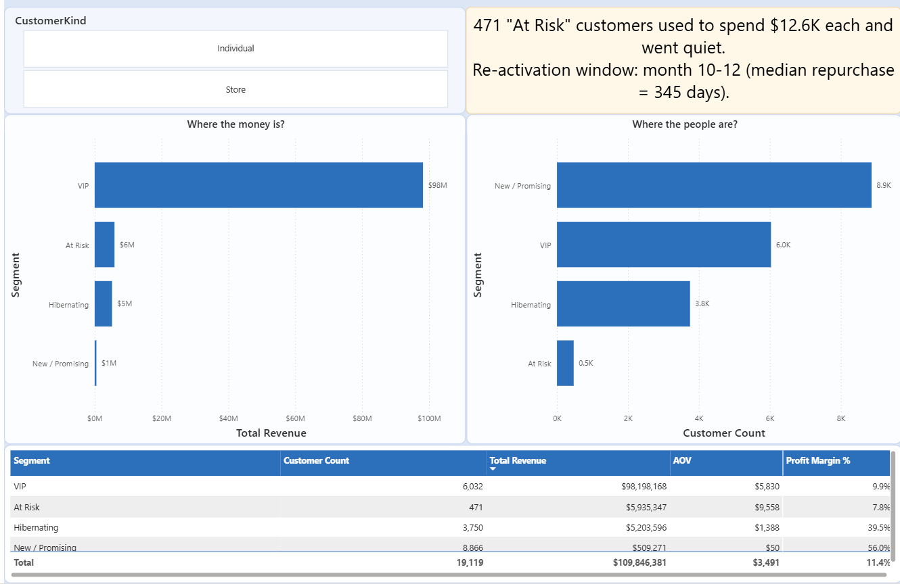
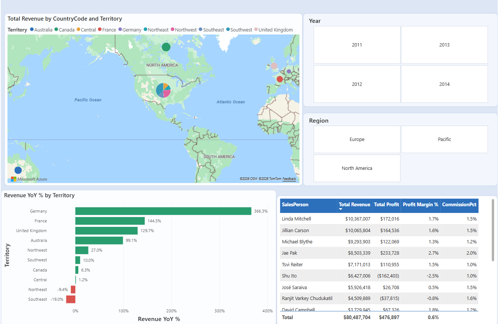
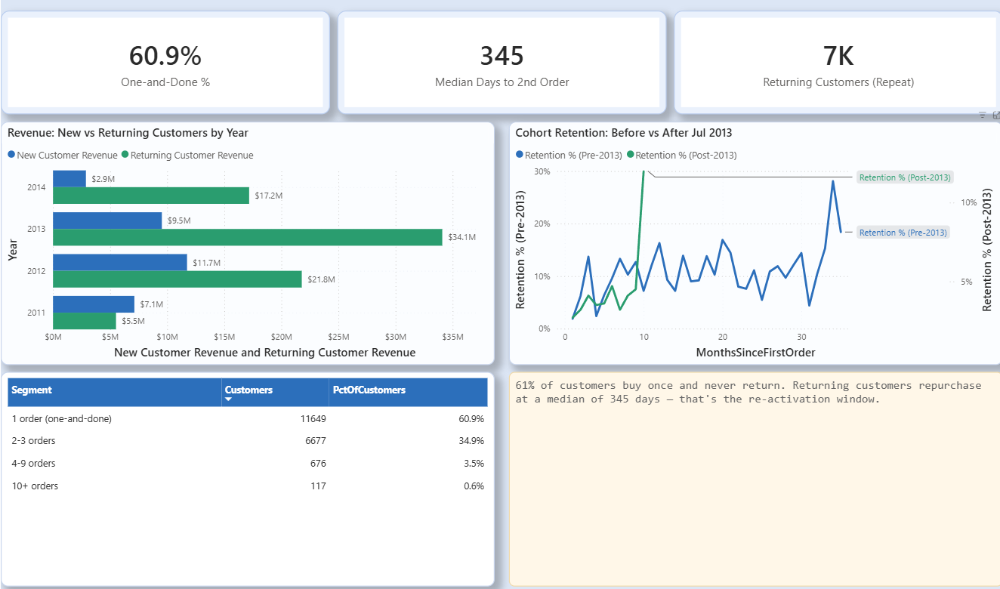
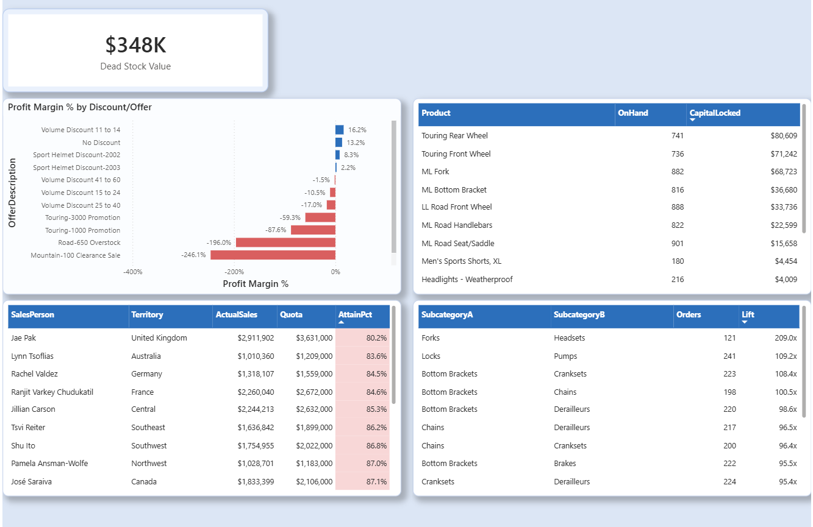

# AdventureWorks 2022 — End-to-End Data Analysis

SQL → Python → Power BI analysis of a $110M / 3-year bike manufacturer dataset (AdventureWorks2022,
Microsoft's standard sample OLTP database). The project follows one investigation from raw
72-table database to an interactive executive dashboard, answering **17 concrete business
questions** along the way.

> **Central question:** where does $110M in revenue come from, where does it leak (discounts,
> losing products, churning customers), and what are the top 3 growth moves for next year?

**🔴 Live interactive dashboard:** https://app.powerbi.com/view?r=eyJrIjoiODk5NTM5YjQtMTk4Ny00NGU2LWFiMzUtYTg1N2YwZDUyYWU4IiwidCI6ImI3YTMxZDI1LWYyMzMtNGM4ZC05ODM0LTdiMjVlZDVlMWU4YSIsImMiOjh9
**Full write-up:** [docs/Executive_Summary.docx](docs/Executive_Summary.docx) (2-page findings + recommendations)
**All 17 questions & status:** [docs/business_questions.md](docs/business_questions.md)

## Tech stack

| Layer | Tool | Role |
|---|---|---|
| Data source | SQL Server 2022 (AdventureWorks2022) | 72-table OLTP database, restored from official `.bak` |
| Analysis | T-SQL (window functions, CTEs, views) | Exploration, profitability, cohort/RFM base data, star-schema views |
| Advanced analytics | Python — pandas, scikit-learn, matplotlib/seaborn | RFM customer segmentation (KMeans), cohort retention, market basket analysis |
| Visualization | Power BI (PBIP project format) | 4-page interactive dashboard on a star schema, DAX time intelligence |

## Project structure

```
adventureworks-analysis/
├── sql/
│   ├── 01_schema_exploration.sql       # table map, row counts, key relationships
│   ├── 02_data_profiling.sql           # quality checks: nulls, duplicates, date ranges, outliers
│   ├── 03_sales_analysis.sql           # monthly revenue trend, YoY, channel mix, new-vs-returning
│   ├── 04_product_profitability.sql    # Sales.vw_LineProfit view; margin by category, loss-makers,
│   │                                    # discount impact, dead stock
│   ├── 05_customer_analysis.sql        # Pareto concentration (NTILE), repeat-purchase rate,
│   │                                    # time-to-2nd-order, channel behavior
│   ├── 06_geo_team_operations.sql      # production scrap, territory growth, shipping delay,
│   │                                    # quota attainment, commission vs performance
│   └── 07_powerbi_views.sql            # star schema (schema `pbi`): 1 fact + 5 dimension views
│                                        # consumed directly by Power BI
├── notebooks/
│   ├── 01_customer_segmentation.ipynb  # RFM (Recency/Frequency/Monetary) + KMeans (k=4, elbow
│   │                                    # method) -> writes dbo.CustomerSegments back to SQL
│   └── 02_cohorts_market_basket.ipynb  # monthly cohort retention heatmap + basket affinity
│                                        # (support/confidence/lift) across product subcategories
├── powerbi/
│   ├── AdventureWorksDashboard.pbip    # Power BI project (PBIP: model + report as text/JSON,
│   │                                    # diff-friendly, source-controlled)
│   ├── theme.json                      # report color theme (brand-neutral blue/red palette)
│   ├── dashboard_build_guide.md        # page-by-page build steps
│   ├── powerbi_guide.md                # initial connection & modeling guide
│   └── upgrades_guide.md               # optional polish: dynamic titles, tooltips, drill-through
└── docs/
    ├── business_questions.md           # 17 business questions, grouped by theme, all answered
    ├── Executive_Summary.docx          # 2-page non-technical summary for stakeholders
    └── screenshots/                    # dashboard page exports (referenced below)
```

## How the pieces connect

1. **SQL** explores the raw 72-table database directly against the live server (no data copied
   out) and answers 13 of the 17 business questions with window functions (`LAG`, `NTILE`), CTEs,
   and a reusable `Sales.vw_LineProfit` view that computes true line-level profit using
   point-in-time product cost (`ProductCostHistory`, not current cost).
2. **Python** connects to the *same* live database via `pyodbc` (no intermediate Excel/CSV export)
   to do what's awkward in pure SQL: KMeans clustering for RFM segments, a month-by-month cohort
   retention matrix, and market-basket affinity (lift) across product subcategories. The customer
   segments Python produces are written back into SQL as table `dbo.CustomerSegments` — so SQL,
   Python, and Power BI all read from one shared source of truth, not three disconnected exports.
3. **Power BI** imports 6 purpose-built views (`pbi` schema, created by `07_powerbi_views.sql`) —
   one fact table at sales-line grain plus 5 conformed dimensions, including the Python-derived
   customer segment — and turns the whole analysis into an interactive, drillable dashboard with
   17 DAX measures (revenue, margin, YoY, YTD, running totals, dynamic titles).

## Methodology detail

### SQL phase
- **Schema & profiling** (`01`, `02`): mapped all 72 tables and verified data quality before
  trusting any number downstream — checked for nulls, duplicate keys, and confirmed the usable
  date range (May 2011 – Jun 2014; the final month is partial and excluded from trend comparisons).
- **Sales & growth** (`03`): found the July 2013 inflection point where order volume jumped ~2.4x
  in a single month while average order value collapsed — using `LAG(x, 12)` for true
  year-over-year comparisons that control for seasonality.
- **Product profitability** (`04`): built `Sales.vw_LineProfit`, matching each sale to the
  product's *standard cost at the time of sale* (not today's cost) via `ProductCostHistory`, so
  margin figures reflect what actually happened, not a retroactive recalculation.
- **Customer behavior** (`05`): used `NTILE(10)` to split customers into revenue deciles (Pareto
  analysis) and self-joins with `ROW_NUMBER()` to measure the exact gap between a customer's
  first and second order.
- **Operations** (`06`): closed the remaining questions — production scrap cost, territory YoY
  growth (2012 vs. 2013, the two complete years available), shipping lead time, and quota
  attainment per sales rep per quarter.

### Python phase
- **RFM segmentation**: computed Recency/Frequency/Monetary per customer directly from SQL,
  log-transformed Frequency/Monetary (heavily right-skewed — a few store accounts dwarf everyone
  else), standardized, then ran KMeans with the elbow method to choose k=4. Clusters were mapped
  to business labels (VIP / At Risk / Hibernating / New-Promising) by ranking centroids, not
  hard-coded thresholds.
- **Cohort retention**: grouped customers by month of first order and tracked what % of each
  cohort re-ordered in each subsequent month, producing a retention heatmap that visually
  confirms the ~345-day median repurchase window found independently in SQL.
- **Market basket**: computed support/confidence/lift for every pair of product subcategories
  appearing in the same order — surfaced drivetrain component bundles (lift > 90x) as ready-made
  cross-sell packages, and quantified attach rates for bike-order add-ons (helmets, jerseys,
  bottles) at checkout.

### Power BI phase
- **Star schema**: 1 fact table (`FactSales`, 121K rows at sales-line grain) + 5 dimensions
  (`DimDate`, `DimProduct`, `DimCustomer`, `DimTerritory`, `DimSalesPerson`), all sourced from the
  `pbi` schema views so the model never touches raw OLTP tables directly.
- **DAX measures**: 17 measures including `Total Revenue`, `Profit Margin %`, `Revenue YoY %`
  (via `SAMEPERIODLASTYEAR`), `Revenue YTD` (`TOTALYTD`), `Running Revenue` (cumulative), and
  dynamic page titles that update with the active slicer selection.
- **Conditional formatting**: profit/margin turns red below zero (rule-based, not static) on both
  the category drill-down bar chart and the worst-15-products table, so loss-making areas are
  visible without reading every number.

## Key findings

### 1. Growth is partly an illusion
Order count roughly quadrupled after **July 2013**, but Online average order value collapsed from
$3,217 to $752 in the same window — the "growth" is a mix-shift toward small accessory purchases,
not real expansion. The Store channel (only 12% of orders) still delivers **73% of revenue** at a
healthy, stable ~$20K average order value. New customers acquired after mid-2013 are worth ~74%
less than customers acquired before it ($485 vs. $1,860 average first-year spend).

### 2. The Touring product line is bleeding money
Touring Bikes gross margin: **1.5%** (company average: 11.4%). Every Touring promotion tested lost
**59–88%** margin. ~$350K of dead inventory sits in unsold Touring parts. Production scrap costs
are also concentrated in Touring components. Every part of the business — sales, promotions,
inventory, and manufacturing — agrees: this line needs a re-price or an exit decision.

### 3. Revenue concentration is extreme
The top 10% of customers generate **81.6%** of revenue — closer to an 80/10 split than the usual
80/20 rule. 635 store accounts alone generate roughly 65% of total company revenue. RFM
segmentation (KMeans, k=4) isolated **471 "At Risk" customers** who used to spend $12.6K each on
average and have gone quiet (~849 days inactive) — the single highest-ROI re-activation target,
timed to the 345-day median repurchase window measured independently in both SQL and the Python
cohort analysis.

### 4. Discounts mostly destroy margin
Only the small-volume discount tier (11–14 units, effectively wholesale reorders) improved margin
(+16.2% vs. 13.2% baseline). Every promotional or clearance offer tested lost money, some
catastrophically (Mountain-500 clearance: -354.6% margin; Touring-1000 promotion: -87.6%).

### 5. Europe is the growth story, not the US
2012→2013 revenue growth: Germany **+366%**, France +145%, UK +130%, while the US Northeast and
Southeast territories **shrank** (-9% and -19%). Sales quotas don't reflect this shift — the #2
sales rep by absolute revenue (UK) has the *worst* quota attainment in the company because his
target didn't scale with his territory's real growth.

Full list of all 17 business questions, grouped by theme (sales/growth, product/profitability,
customers, geography/channels, sales team), with a status checkbox for each:
[docs/business_questions.md](docs/business_questions.md)

## Dashboard

**👉 [Open the live interactive dashboard](https://app.powerbi.com/view?r=eyJrIjoiODk5NTM5YjQtMTk4Ny00NGU2LWFiMzUtYTg1N2YwZDUyYWU4IiwidCI6ImI3YTMxZDI1LWYyMzMtNGM4ZC05ODM0LTdiMjVlZDVlMWU4YSIsImMiOjh9)** — no login required, opens directly in your browser.

To edit or reproduce it locally: open `powerbi/AdventureWorksDashboard.pbip` in Power BI Desktop
(Windows auth, points at `.\SQLEXPRESS`, database `AdventureWorks2022`).

| Page | Focus | Key visuals |
|---|---|---|
| **Executive Overview** | Revenue trend, growth, channel split, geography | KPI cards, revenue-vs-LY line chart with annotation, country map, online/store donut |
| **Product Profitability** | Category/subcategory margin, worst performers | Drill-down bar (Category → Subcategory → Product), revenue-vs-margin scatter, worst-15 table |
| **Customer Segments** | RFM segments, value concentration | Revenue-by-segment vs. count-by-segment bar pair, segment summary table |
| **Territory & Team** | Territory growth, rep performance | Revenue map, YoY-by-territory bar, sales rep performance table |
| **Customer Behavior** | New vs. returning, repeat-purchase, cohort retention | One-and-done % card, new-vs-returning revenue by year, pre/post-2013 retention curve, repeat-purchase segments |
| **Discounts & Operations** | Promotion impact, dead stock, quota, cross-sell | Margin-by-offer bar, dead-stock table, quota attainment table, top basket-affinity pairs |

### Screenshots

| Executive Overview | Product Profitability |
|---|---|
|  |  |

| Customer Segments | Territory & Team |
|---|---|
|  |  |

| Customer Behavior | Discounts & Operations |
|---|---|
|  |  |

## Setup / reproduce

**Prerequisites:** SQL Server (Express is fine) with the AdventureWorks2022 backup, Python 3.11+
with `pyodbc`, `pandas`, `scikit-learn`, `matplotlib`, `seaborn`, `nbconvert`, and Power BI Desktop.

1. Restore `AdventureWorks2022.bak` to a local SQL Server instance (`RESTORE DATABASE ... WITH MOVE`
   if the default data path differs from the backup's).
2. Run `sql/01` through `sql/07` in order — `07_powerbi_views.sql` creates the `pbi` schema views
   Power BI reads; run it after `04` since it reuses `Sales.vw_LineProfit`.
3. Run both notebooks in `notebooks/` (`jupyter nbconvert --to notebook --execute --inplace <file>`,
   or open in VS Code/Jupyter and run all cells) — notebook 1 writes `dbo.CustomerSegments`, which
   `pbi.DimCustomer` depends on, so run it before opening Power BI.
4. Open `powerbi/AdventureWorksDashboard.pbip` in Power BI Desktop and Refresh.

## Notes on scope

- The Jun 2014 partial month is deliberately excluded from month-over-month trend visuals and
  filters (the data collection stops mid-month, which would otherwise look like a demand crash).
- 2012 vs. 2013 (not 2013 vs. 2014) is used for territory growth comparisons, since those are the
  only two *complete* calendar years available.
- Shipping lead time was checked (`06_geo_team_operations.sql`) and found to be a flat, healthy
  7 days across every territory — reported as a non-finding rather than omitted, since ruling out
  an operational bottleneck is itself a useful answer.
